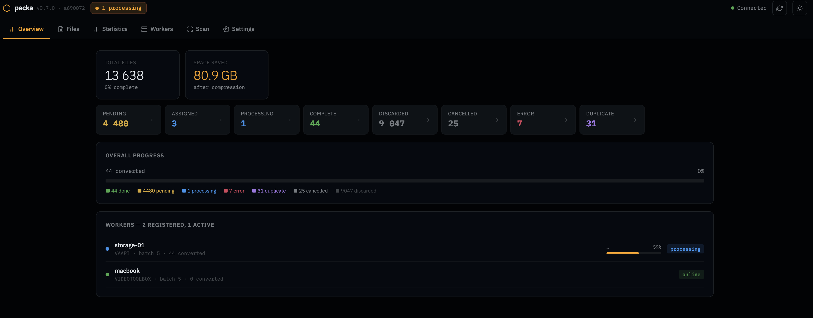

# Packa

> **Note:** This project is 100% AI-generated using [Claude](https://claude.ai) by Anthropic. Do with this information as you wish.

Packa is a distributed video conversion system. A **master** node manages a queue of files and distributes work to one or more **worker** nodes. Workers pull jobs, run ffmpeg to convert to HEVC, and report results back. A **web** frontend provides a browser dashboard for monitoring and control.

Files are never transferred over the network — workers access them directly via the filesystem.

Encoder support is fully config-driven — each encoder is defined as a set of ffmpeg arguments in `packa.toml`. Any encoder supported by the ffmpeg build in use will work. The Docker image is based on [`linuxserver/ffmpeg`](https://github.com/linuxserver/docker-ffmpeg), so any hardware encoder supported by that image works out of the box.



---

## Quick start

```bash
cp packa.example.toml packa.toml
# edit packa.toml to match your setup
docker compose up
```

The compose file expects `packa.toml` in the current directory. A single image covers all three roles, selected via the `PACKA_ROLE` environment variable (`master`, `worker`, or `web`).

---

## Security

All inter-node communication uses mutual TLS. Master auto-generates a CA on first start and prints a bootstrap token; workers and the web process exchange that token for a signed client certificate. See [Architecture — Security](docs/architecture.md#security) for details.

---

## Documentation

- [Configuration](docs/configuration.md) — config file reference, environment variables, encoder presets
- [Architecture](docs/architecture.md) — pull model, path prefix translation, databases, file status lifecycle
- [UI reference](docs/ui.md) — dashboard tabs, file filtering, worker cards, keyboard/mouse interactions
- [API reference](docs/api.md) — master and worker HTTP endpoints
